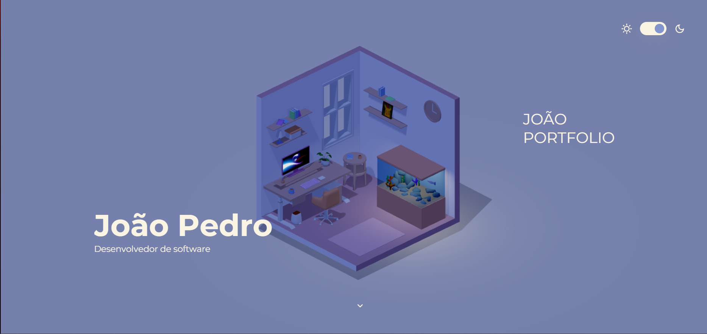

# Portfolio_3D

# Portfólio João Pedro

Portfólio pessoal de **João Pedro**, estudante de Ciência da Computação e desenvolvedor de software. O projeto apresenta minhas habilidades, experiências e contatos de forma moderna e interativa.

---

## Tecnologias

- HTML5 | CSS3 | JavaScript (ES6+)
- SVGs para ícones (Devicon e Simple Icons)
- Design responsivo e modo claro/escuro

---

## Instruções para rodar localmente

# Clone o repositório
git clone https://github.com/jpsouza25/Portfolio_3D.git

# Entre na pasta do projeto
cd Portfolio_3D-main

# Instale as dependências
npm install

# Rode o servidor de desenvolvimento
npm run dev
